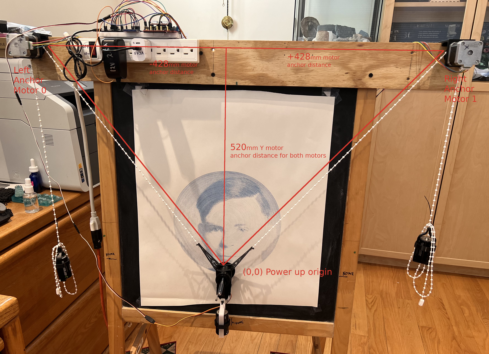
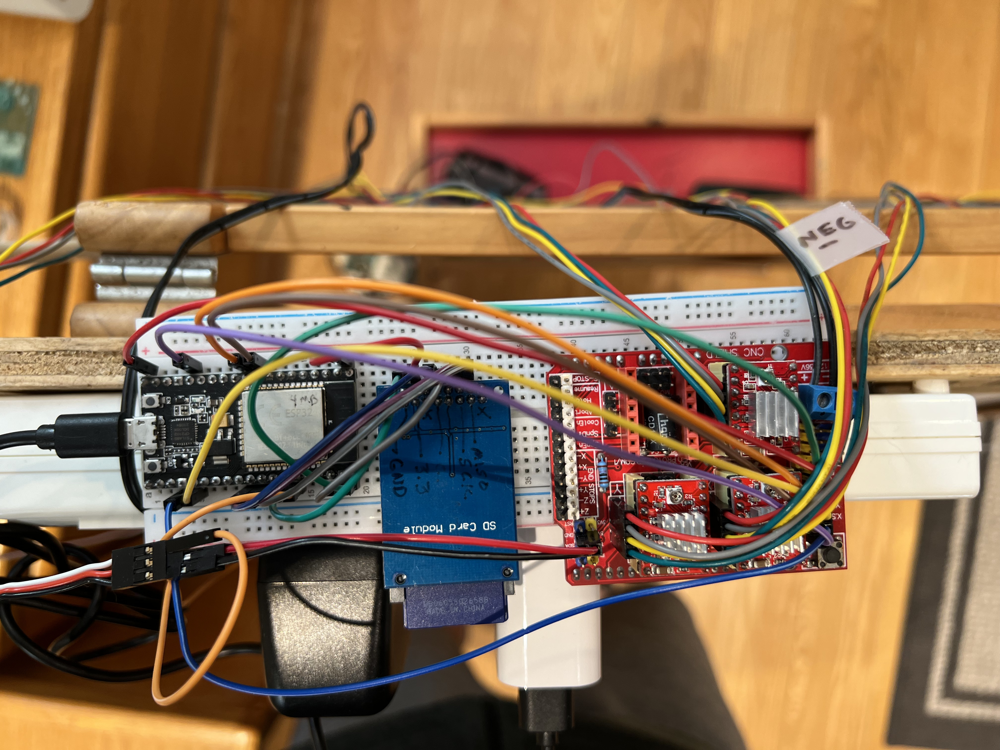
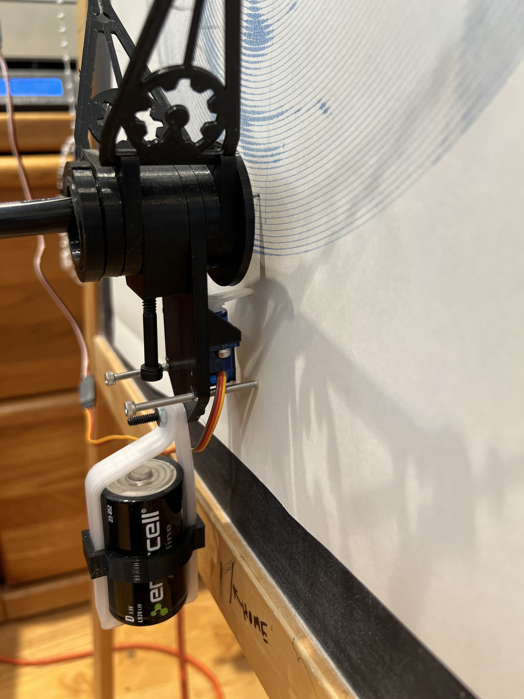
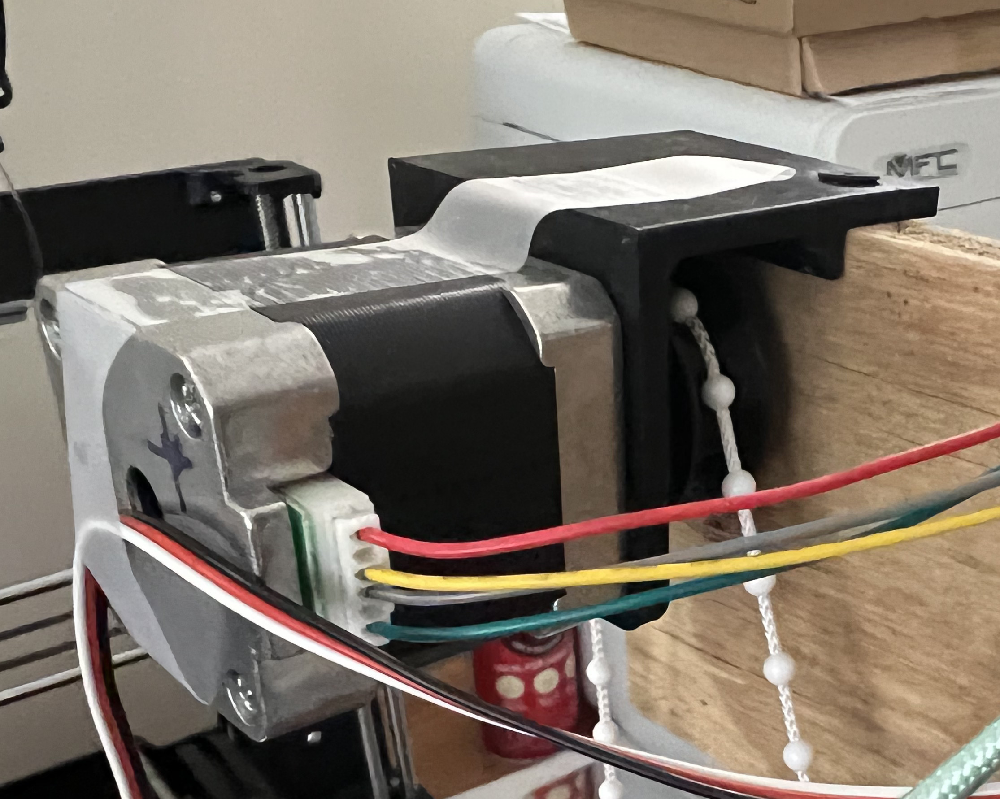
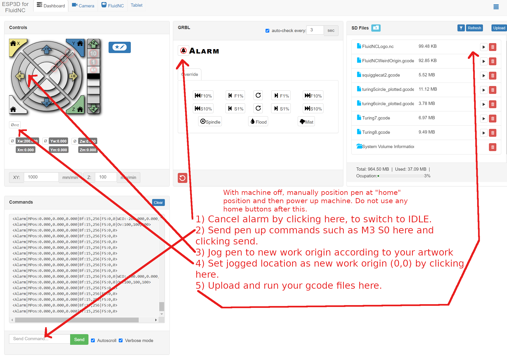

# Wall Plotter

## Introduction

This machine is based on the many designs that exist on the internet that go by various names such as polarbot, drawbot, polargraph etc.. Specifically, this machine is where a gondola/puck holds a marking device such as a pen or marker and is controlled by two opposing hanging cords connected to two  motors. There is a wide variety of software that is used to control such a device.

The purpose of this module was to use a kinematic module in the new FluidNC modular approach to kinematics based on the work of pentacular. The main advantage is that this would allow the use of more commonly available software that understands gcode instead of some specialized software to drive the machine. 

## Test machine







The 3d printed parts are based on those found at https://www.thingiverse.com/thing:798076.

The machine used for testing is shown above. An ESP32 board is running FluidNC. This is connected to a SPI based SD card module which can hold gcode files to be executed so that a gcode sender does not need to be connected to the machine while it is drawing. The ESP32 is also connected to an arduino cnc shield that has two 4998 stepper drivers installed in the X and Y sockets. This shield is not really a great match for the ESP32, but it is all that I had. The arduino CNC shield is being driven with 3.3v logic from the ESP32 board. A small 12V 2.5A power supply is being used to provide motor power to the stepper motor drivers. A servo is being used to control the pen up and down movements and is controlled using gcode spindle (M3 M5 S0 S255 ) commands similar to the way many laser cutting systems use. Alternatively, the pen can be configured as a z axis in the .yaml file although I have not tested that yet.

There are no home or limit switches. The machine is manually positioned to a defined (marked) origin while off. This location is defined in the .yaml file. When the ESP32 powers up, this fixed location is considered the machine home position. Once “homed” it can be jogged to a new origin before drawing begins using the default G54 work coordinate system in FluidNC. 

Once configured, the entire machine can be run wirelessly via wifi through the built in web interface. Gcode files can be directly uploaded to the sd card and then executed from the sd card via the web interface. No pc running gcode sender software needs to be tethered to the machine. Pretty cool.



## Configuring the .yaml file

FluidNC configures many of its parameters in a .yaml file which is really nice because changes can be made to the system and no recompilation of code is necessary. An example file for the machine pictured is shown below along with a description of some of the special values that you may need to change for a wall plotter. Please note that .yaml files are picky about indentation. 


EXAMPLE:
```
name: "ESP32 Dev Controller V4"
board: "WallPlotter ArduinoCNC Shield"

kinematics:
  WallPlotter:
    left_axis: 0
    left_anchor_x: -428.000
    left_anchor_y: 520.00
    right_axis: 1
    right_anchor_x: 428.000
    right_anchor_y: 520.00
    segment_length: 2.0

stepping:
  engine: RMT
  idle_ms: 250
  dir_delay_us: 1
  pulse_us: 10
  disable_delay_us: 0

axes:
  shared_stepper_disable_pin: gpio.13
  
  x:
    steps_per_mm: 8.250
    max_rate_mm_per_min: 4000
    acceleration_mm_per_sec2: 400
    max_travel_mm: 4000
    homing:
      cycle: 0
      mpos_mm: 0
      positive_direction: false
    
    motor0:
      stepstick:
        direction_pin: gpio.25
        step_pin: gpio.15

  y:
    steps_per_mm: 8.250
    max_rate_mm_per_min: 4000
    acceleration_mm_per_sec2: 400
    max_travel_mm: 4000
    homing:
      cycle: 0
      mpos_mm: 0
      positive_direction: false

    motor0:
      limit_all_pin: NO_PIN
      stepstick:
        direction_pin: gpio.26
        step_pin: gpio.2
  z:
    steps_per_mm: 2000
    max_rate_mm_per_min: 500
    acceleration_mm_per_sec2: 100
    max_travel_mm: 5
    homing:
      cycle: 0
      mpos_mm: 0
      positive_direction: false

    motor0:
      rc_servo:
        pwm_hz: 50
        output_pin: gpio.27
        min_pulse_us: 700
        max_pulse_us: 2200

spi:
  miso_pin: gpio.19
  mosi_pin: gpio.23
  sck_pin: gpio.18

sdcard:
  cs_pin: gpio.5
  card_detect_pin: NO_PIN

coolant:
  flood_pin: NO_PIN
  mist_pin:  NO_PIN
        
probe:
  pin: gpio.32:low:pu

besc:
  pwm_hz: 50
  output_pin: gpio.21
  enable_pin: NO_PIN
  direction_pin: NO_PIN
  disable_with_s0: false
  s0_with_disable: true
  spinup_ms: 2000
  spindown_ms: 2000
  tool_num: 100
  speed_map: 0=0.000% 255=100.000%
  min_pulse_us: 600
  max_pulse_us: 2300
```

In the kinematics section you can see that we are selecting the “WallPlotter” kinematics module and defining some key parameters associated with it. The left anchor motor is motor 0. The right anchor motor is motor 1. The pen is considered to be the origin (0,0) on power up. The position of each anchor motor is defined relative to this “home position” of the pen on power up. You will need to make sure that you always have the pen in this reference position on power up and you should have this somehow marked on your system so you can do this repeatably. It is best to make the measurements for the  left_anchor x y and right_anchor x y postions from the point defined by the pen tip to the imaginary line that connects the two points where the cords first contact the motor pulley (see diagram). The segment_length in mm is used to divide up movements into smaller segments during the kinematic conversion and should be chosen so that drawn arcs and lines look correct.

On the machine pictured, the steps_per_mm were computed as follows:
The stepper motor is a 1.8 degree per step motor with the motor driver jumpers configured for ¼ steps with a pulley on the stepper shaft with a diameter of 31mm. This gives us:

((360/1.8) * 4) / (31*3.14159) = 8.21 steps/mm

This is a starting point for this value and you may have to draw some objects of a known size and fine tune this number. The other numbers for rate and acceleration are obtained through trial and error. 

Bear in mind these systems are not super accurate. The stretch in the cords varies depending on length and angle. There is sag in the cords depending on length. The tangent point where the cord contacts the pulley varies with position. Position resolution and strain varies as you get to the edges of the system and you should keep your drawings away from the top and also left and right edges. The kinematics system does not compensate for any of this, but it is good enough for most drawing applications. One of the coolest things about these systems is that they can be made quite large with very little added cost.

The besc section sets up the pen to look like a spindle that is controlled by a brushless electronic speed control. A cheap blue 9g chinese servo was used and connected to ESP32 5V, ground and GPIO.21. Different min_pulse_us and max_pulse_us may be needed for other brands...

As configured the servo should move the pen as follows:
 * M3 S0  is lift pen up from paper
 * M3 S255 is put pen down on paper
 
If you need to invert motion of the servo, switch the values for min_pulse_us and max_pulse_us.

It is also possible to configure a Z axis as either a servo or stepper motor and use Z motion commands to move the pen up or down. This has not been tested yet.

## Generating gcode for drawing

Since the system understands standard gcode, a wide variety of options are available for creating art and generating the gcode. If you are already familiar with laser systems, which act in a similar fashion, the following can be used:

https://lasergrbl.com/

https://laserweb.yurl.ch/

https://lightburnsoftware.com/

There are also online web based tools with a good collection here:

https://drawingbots.net/knowledge/tools/svg-generator

My personal favorite is specifically designed for drawing machines and has a very capable free version along with a more sophisticated premium version:

https://drawingbotv3.readthedocs.io/en/latest/about.html

These all work in a similar fashion. Artwork in the form of jpegs, png and svg are imported, scaled and positioned in mm (not pixels). In the case of raster formats (png, jpg), such images need to be converted to vectors through a variety of artsy tools and filters in the software. Once converted to vectors, they can be converted to gcode through a generate/export gcode step. It is necessary to tell the software some important things about your machine in order to generate the correct gcode. At a minimum:

* START
* PEN UP (aka Laser OFF)
* PEN DOWN (aka Laser ON)
* END

For START usually you need something similar to:
```
G21 (programming in millimeters, mm)
G90 (programming in absolute positioning)
G28 (auto homing)
M3 S0 (make sure pen is up)
G1 F100 (set drawing speed)
```

For pen down usually you need something like: 
```
M3 S255 (pen down)
```

For pen up usually you need something like:
```
M3 S0 (pen up)
```

For end gcode:  
```
M3 S0 (pen up)
G0 X0 Y0 (GO BACK TO DRAWING ORIGIN)
```
Once the gcode is generated, it can be uploaded via the web interface. It is however a good idea to use some kind of gcode preview program to make sure things look correct, such as origin placement and drawing boundaries displayed in mm. I used LaserGRBL for this, since it is a simple drag and drop of the file onto the LaserGRBL desktop icon to launch and preview, but there are many others.

## Still To Do


